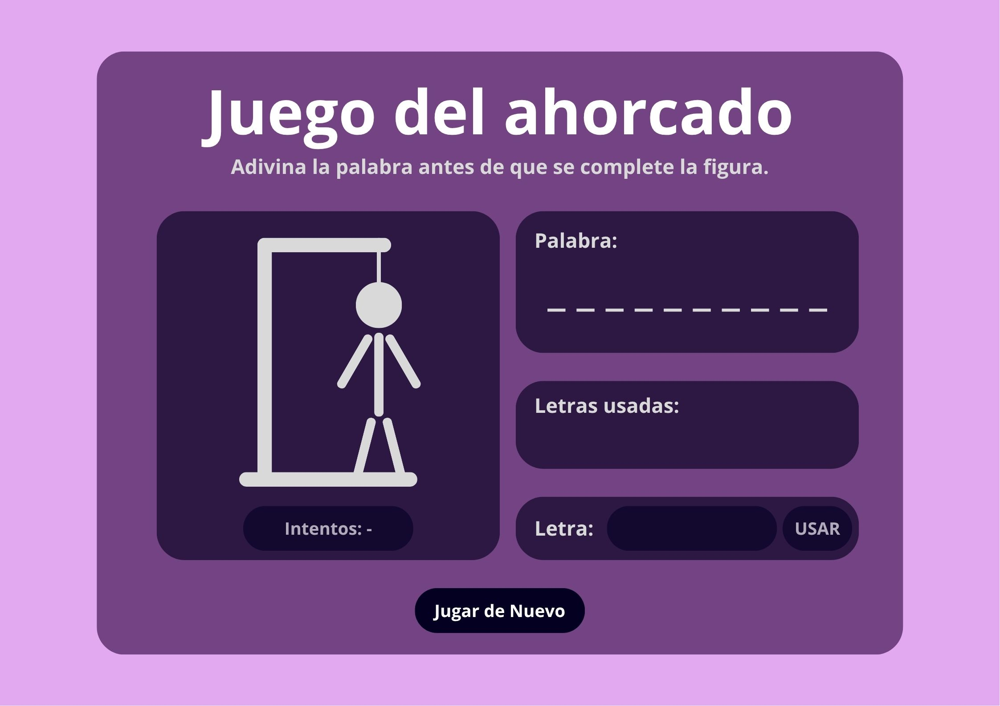
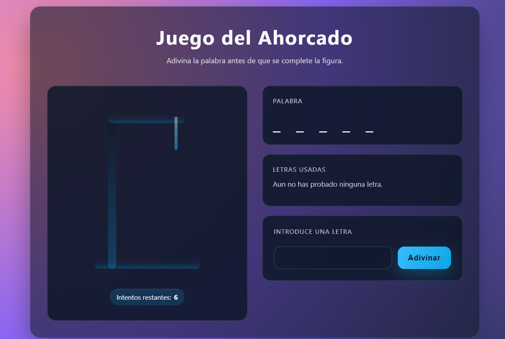

# AhorcadoPHP

AhorcadoPHP es un juego sencillo que te invita a adivinar palabras letra a letra directamente desde el navegador. Todo está pensado para que cualquiera pueda probarlo sin complicaciones.

## Qué incluye este proyecto
- Página con el tablero del ahorcado y las letras disponibles.
- Mensajes claros que te indican si has ganado o si ya no quedan intentos.
- Botón para volver a empezar sin necesidad de recargar la página.
- Lista de palabras guardadas en un archivo de texto, para que cada partida sea diferente.
- Carpeta `recursos` para almacenar imágenes, sonidos o notas de diseño.
- Archivos listos para abrir el proyecto con Docker si prefieres no configurar nada manualmente.

## Cómo se vive la partida
1. Entras en la página y ves los espacios vacíos de la palabra secreta.
2. Eliges letras desde tu teclado o mediante los botones en pantalla.
3. Cuando aciertas, las letras aparecen en su sitio.
4. Con cada fallo se dibuja una nueva parte del muñeco.
5. Ganas si completas la palabra antes de que el dibujo quede terminado.
6. Si se agotan los intentos, pulsa el botón de reinicio y prueba de nuevo.

## Evolución visual
| Mockup inicial | Mockup final |
| --------------- | ------------- |
|  |  |

## Guía rápida para ponerlo en marcha
1. Instala Docker Desktop y asegúrate de que está en ejecución.
2. Abre una terminal y entra en la carpeta del proyecto.
3. Ejecuta `docker compose up --build` para arrancar el servidor.
4. Cuando aparezca el mensaje de que el servidor está listo, visita `http://localhost:8080/` en tu navegador.
5. Para detenerlo, vuelve a la terminal y presiona `Ctrl + C`.

## Notas finales
- Si quieres añadir nuevas palabras, edita el archivo `src/public/ahorcado/words.txt`, una palabra por línea.
- Los estilos se encuentran en `src/public/ahorcado/style.css`, por si deseas ajustar colores o tipografías.
- Cualquier duda o mejora que se te ocurra puedes anotarla directamente en este archivo para mantener el proyecto claro para todos.
